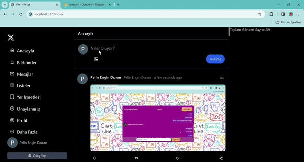

# It is an X (twitter) project created with Firebase.

-You can log in using Google or password & email on the login page.

-When you forget your password, a password reset request is sent to your e-mail address.
The password is reset with the referral link.

*In tweets;
-Document, add/update/edit/delete/like & remove,

-Sending media content,

# Pagination
-react-router-dom

-react-toastify

-momentum

-uuid

-firebase

-tailwind

-react-icon

# Firebase ile oluşturulmuş X (twitter) projesidir.

-Giriş sayasında google ile veya şifre & email ile giriş yapılır.

-Şifre unuttuğunda mail adresine şifre sıfırlama isteği yapılır. Yönlendirme linki
ile şifre sıfırlanır.

*Twitlerde;
-Döküman ekleme/güncelleme/düzenleme/silme,

-Medya içeriği gönderme,

# Sayfalama
-react-router-dom

-react-toastify

-moment

-uuid

-firebase

-tailwind

-react-icon

